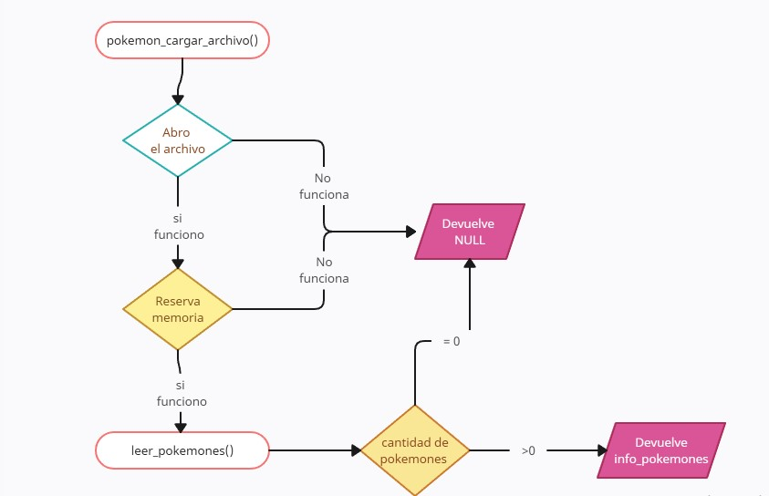

<div align="right">

</div>

# TP1

## Repositorio de Santiago Henseler - 110732 - shenseler@fi.uba.ar

- Para compilar:

```bash
gcc *.c -o entrega -std=c99 -Wall -Wconversion -Werror -lm
```

- Para ejecutar:

```bash
./entrega
```

- Para ejecutar con valgrind:
```bash
valgrind --leak-check=full --track-origins=yes --show-reachable=yes --error-exitcode=2 --show-leak-kinds=all --trace-children=yes ./entrega
```
---
##  Funcionamiento del código

-  *Explicación de cómo los pokemon quedan ordenados alfabéticamente:*
<br/>

El algoritmo para que los pokemons queden ordenados alfabeticamente se implemento en el archivo `src/pokemon.c`, en la función `ordenar_pokemones()`. La función recibe por parámetro todos los pokemones válidos. Los itera pokemon a pokemon comparándolos afabéticamente con el resto, almacenando en la variable `min` la posición del menor elemento. una vez terminada  la comparación, en un puntero auxiliar `aux` almacena el pokemon en la posición min y luego lo intercambia por el pokemon en la posición `i`. Se repite el proceso hasta que todos los pokemones queden ordenados.
<br/>
-  *Análisis de la complejidad del algoritmo que ordena alfabéticamente los pokemons:*
```c
void ordenar_pokemones(struct info_pokemon *ip)
{
	for(int i = 0; i < ip->cantidad_pokemones; i++){ // ---> N
		int min = i;    // ---> 1

		for(int j = i; j < ip->cantidad_pokemones; j++){ // ---> N
			if(strcmp(ip->pokemones[min]->nombre, ip->pokemones[j]->nombre) > 0){
				min = j; // ---> 1
			}
		}

		struct pokemon *aux = ip->pokemones[min]; // ---> 1
		ip->pokemones[min] = ip->pokemones[i]; // ---> 1 
		ip->pokemones[i] = aux; // ---> 1

	}
}
```

Contando todas las instrucciones se llega a la siguiente ecuación: `T(n) = (1+1+1+1)*n*n` . Entonces el algoritmo de ordenar_pokemones() tiene una complejidad de *O(n²)* porque: `4n² < N * n² , ∀ N > 4`

---

-  *Explicación de algunas funciones y del manejo de la memoria:*
Ahora voy a explicar como implemente la funcion `pokemon_cargar_archivo()` porque considero que fue la más dificil de implementar.

Al llamar a la función, se debe pasar por parámetro un archivo. Si el archivo es NULL o si no se puede abrir la funcion termina y devuelve NULL.

Si no termina, se reserva memoria dinámica en el puntero `info_pokemones` con `malloc()` para almacenar todos los pokemones válidos que estén en el archivo. Si no se puede reservar esa memoria, la función termina y devuelve NULL.

Si se reserva memoria correctamente se llama a la función `leer_pokemones()`. Luego de leer todos los pokemones, si la cantidad de pokemones válidos es mayor a 0 se devuelve el puntero donde se almacenaron `(info_pokemones)`. Si no hay pokemones válidos devuelve NULL.

*Aclaración:* La función `pokemon_cargar_archivo()` la subdividí en varios módulos para que sea más lejible el código y encontrar errores de manera más sencilla.
	
<div align="center">

</div>

Al llamar a la función `leer_pokemones()` se pasa por parámetro el archivo abierto y el puntero `info_pokemones`. Recorre el archivo linea por linea y si en la linea hay pokemones o ataques llama a `cargar_nombre_pokemon` o a `cargar_ataque_pokemon`. 

*Aclaración:* Para mejorar la "lectura" del código implementé la libreria `cargar_pokemones.h` en la que pretendía crear la mayoria de funciones para cargar los pokemones (`cargar_nombre_pokemon` o `cargar_ataque_pokemon` por ej.) pero al manejar los structs de manera opaca y no poder modificar `pokemon.h` pude implementar pocas funciones en esta libreria.

La función `cargar_nombre_pokemon` parsea el nombre de pokemon y su tipo, devolviendo un puntero a un `struct pokemon`. Maneja la memoria de la siguiente manera:
	- Reserva memoria dinámica con `malloc()` en heap
 	- Devuelve el puntero a la memoria reservada en el heap
  
<div align="center">

</div>

Cuando se devuelve el puntero a lo que se reservó en la función `cargar_nombre_pokemon()`, en la función `leer_pokemones()` se le asigna ese puntero.

<div align="center">

</div>

la función `cargar_ataque_pokemon` maneja la memoria de igual manera que la función `cargar_nombre_pokemon()` por eso no la explico.

Cuando finaliza la función `pokemon_cargar_archivo()` la memoria queda distribuida de la siguiente manera:

<div align="center">

</div>

Cuando se usa la función `pokemon_destruir_todo()` se iteran todos los campos de la memoria como está distribuída en la imagen de arriba y se los va borrando desde adentro hacia afuera para no perder los punteros. 
